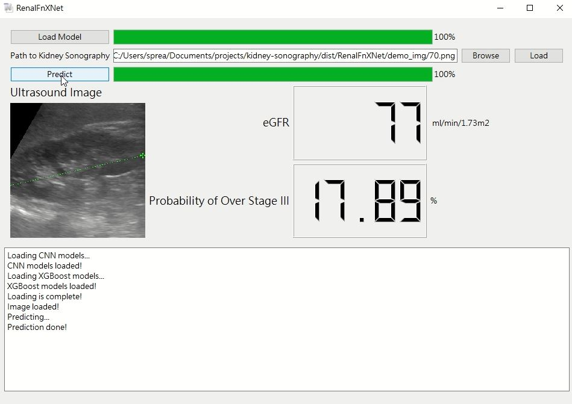

# Automation of the Kidney Function Prediction and Classification Through Ultrasound-based Kidney Imaging Using Deep Learning


## Prediction module
This repository contains the code of the prediction model used in the paper **Automation of the Kidney Function Prediction and Classification Through Ultrasound-based Kidney Imaging Using Deep Learning**. The paper has been accepted by npj Digital Medicine.
The propsed automated system ensembles 10 trained models to predict estimated glomerular filtration rate (eGFR), and 10 trained gradient-boosted tree models to classify CKD stage.
Go to [project blog post](https://spreadwyvern.github.io/projects/kidney/egfr/) for more information.

- 2019.03.19
Added GUI of the prediction module. See below for instructions.

### Dependencies
This work uses Python 3.5.2. Before running the code, you have to install the following.
- torch==0.2.0_3
- torchvision==0.2.1
- pandas==0.20.3
- numpy==1.15.3
- xgboost==0.72
- opencv-python==3.4.0
- Pillow==5.1.0

The above dependencies can be installed using pip by running:
```
pip install -r requirement.txt
```

### Usage
1. Run get_models.sh to retrieve 10 trained CNN model weights and 10 trained XGBoost models. (Warning! The file size is about 1.7 GB).
```
bash get_models.sh
```
2. Execute ensemble_predict.py
```
python3 ensemble_predict.py
```
3. Input file path to a cropped kidney sonography. The images whould be 224 x 224 and cropped with tailor-cropped method mentioned in the paper.
```
use GPU: True
numbers of GPU: 1
Input image path:
```
4. First time running will required loading the trained models, then the script shall return the predicted eGFR and the possibility of the subject's CKD stage being over stage III.

### Help
Use --help to see usage of ensemble_predict.py:
```
usage: ensemble_predict.py [-h] [-g]

optional arguments:
-h, --help    show help message and exit
-g, --gpu_id  assign GPU ID, default 0
```

## GUI
For ease of future clinical use, added a GUI for the predictiom module.

### Usage
1. Run get_models.sh to retrieve 10 trained CNN model weights and 10 trained XGBoost models. (Warning! The file size is about 1.7 GB).
```
bash get_models.sh
```
2. Execute predict.py
```
python3 predict.py
```

### Demonstration Video
[](https://drive.google.com/file/d/1ZA_Six_tb08KlZSlzHtbEbx7K01fn_xA/preview)

### Windows distribution
Executable application for Windows environment. The full model version utilizes the 10-model-ensemble model used in our paper, it requires a GPU with 4GB VRAM. There is also a lite version with 5-model ensemble which requires 2GB VRAM, suitable for entry-level GPUs, yet at a cost of performance.
#### Usage
Dowload the file below and extract. Execute 'RenalFnXNet.exe'.

[Full model version](https://drive.google.com/file/d/1Z8sPhdyFDz90-AZOTdenYmC8xNrQSK0C/view?usp=sharing)
Requires GPU with 4GB of RAM

[Lite version with 5-model ensembling](https://drive.google.com/file/d/1ZCcpfp17kTvy3AVVxPYp78C-gHUk-jUG/view?usp=sharing)
Requires GPU with 2GB of RAM